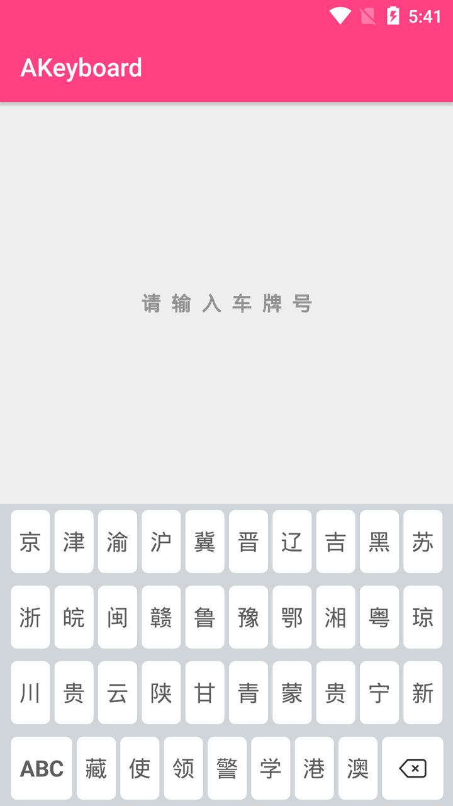
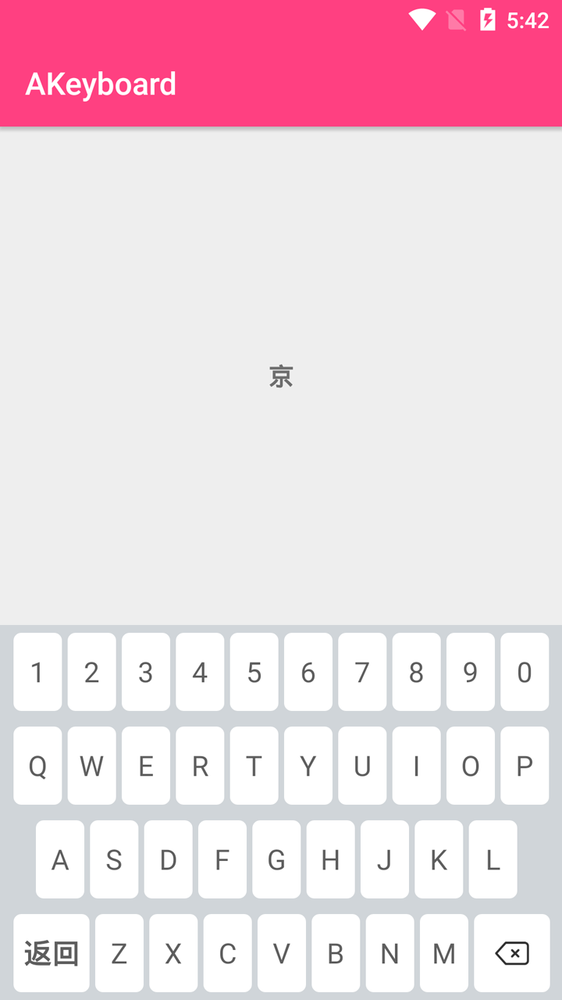

# AKeyboard

[](https://jitpack.io/#leguang/ADialog)

AKeyboard是一个简单易用的自定义软键盘，利用KeyboardView配合xml来定制键盘内容。（欢迎Star一下）


## 能做什么？([下载 apk](https://github.com/leguang/ADialog/blob/master/app-debug.apk))
- **对于输入车牌号做了相应的逻辑适配**

## 如何使用它？

1. 先在项目目录下的的build.gradle 的 repositories 添加:
```
	allprojects {
		repositories {
			...
			maven { url "https://jitpack.io" }
		}
	}
```

2. 然后在App目录下的dependencies添加:
```
	dependencies {
	     //一个自定义车牌输入软键盘。
   		 compile 'com.github.leguang:AKeyboard:0.0.1'
	}
```
此时同步一下，即已完成引入。

### 简单使用：

可以参考Demo中有更多使用实例进行改造。

>**持续更新!，欢迎Issues+Star项目**

## License

```
Copyright 2016 李勇

Licensed under the Apache License, Version 2.0 (the "License");
you may not use this file except in compliance with the License.
You may obtain a copy of the License at

   http://www.apache.org/licenses/LICENSE-2.0

Unless required by applicable law or agreed to in writing, software
distributed under the License is distributed on an "AS IS" BASIS,
WITHOUT WARRANTIES OR CONDITIONS OF ANY KIND, either express or implied.
See the License for the specific language governing permissions and
limitations under the License.

```

